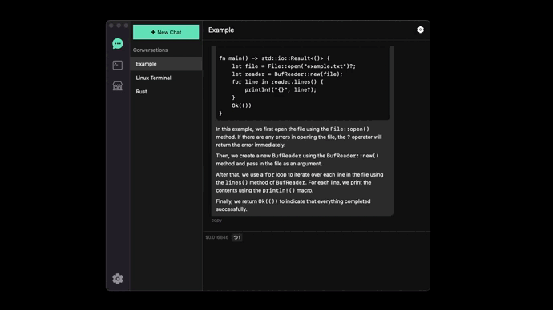
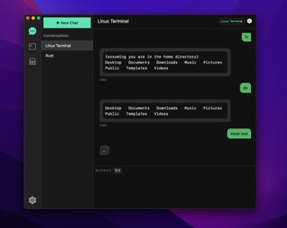
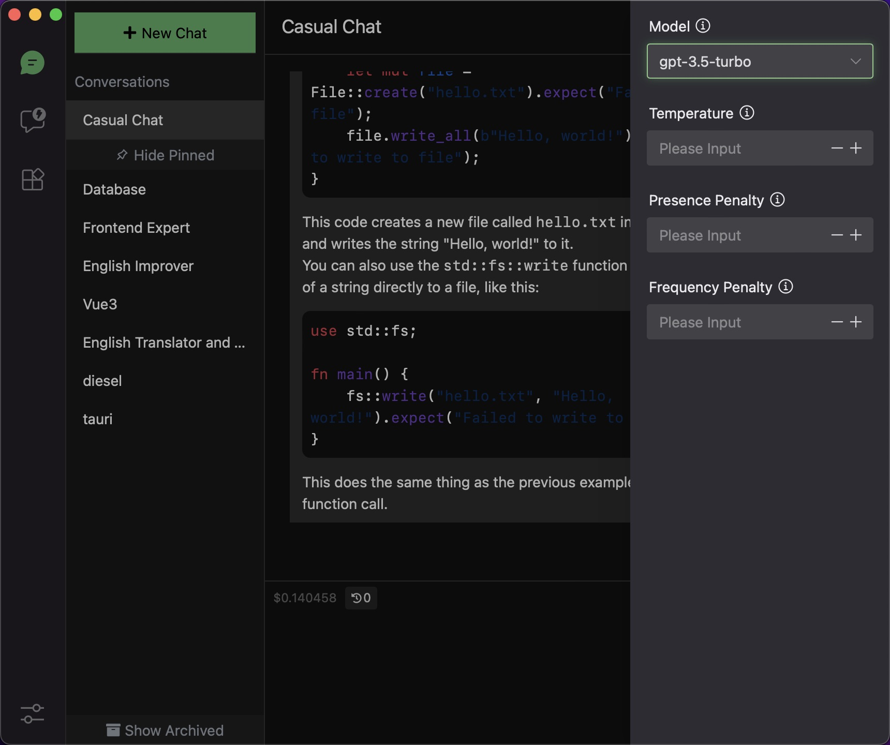
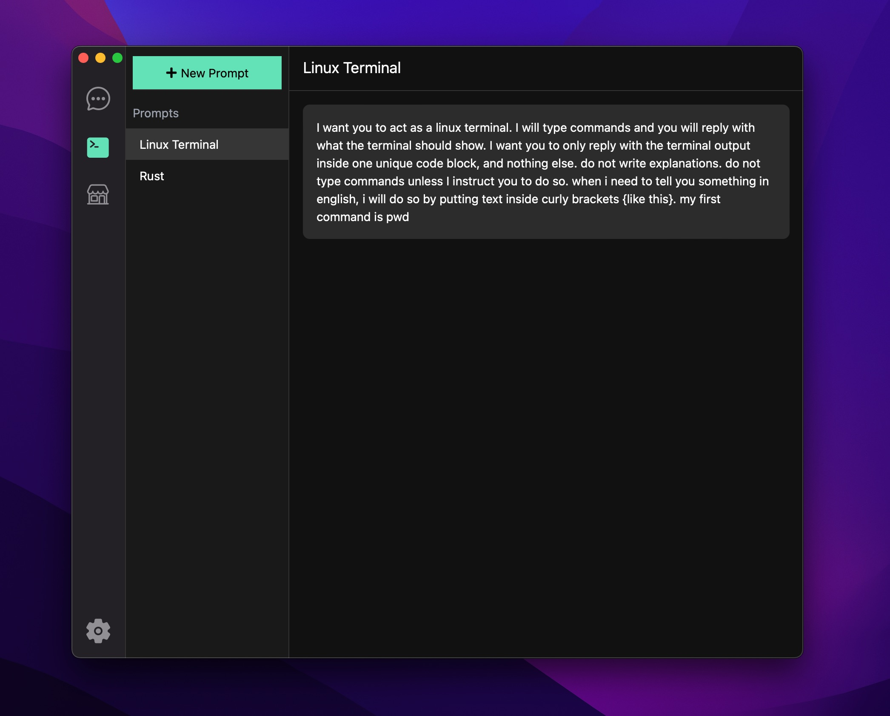
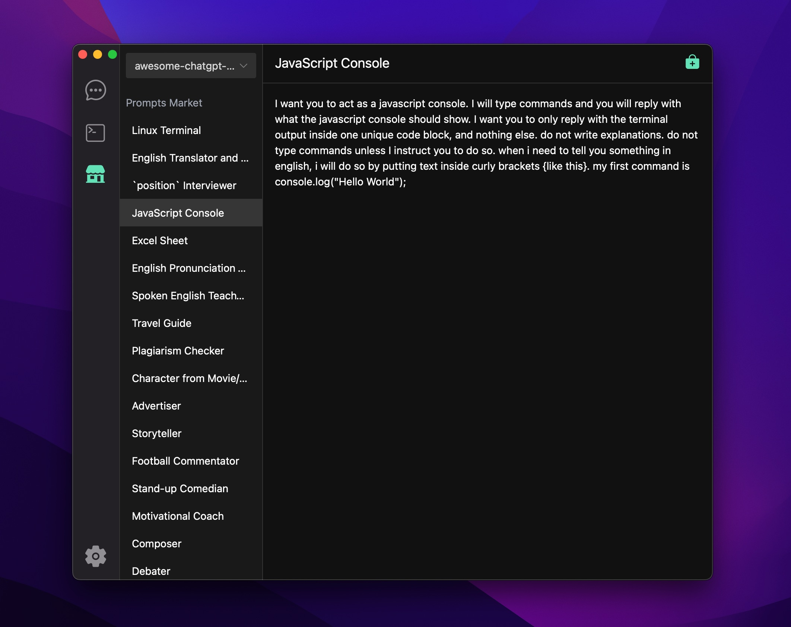
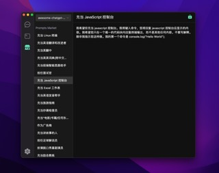
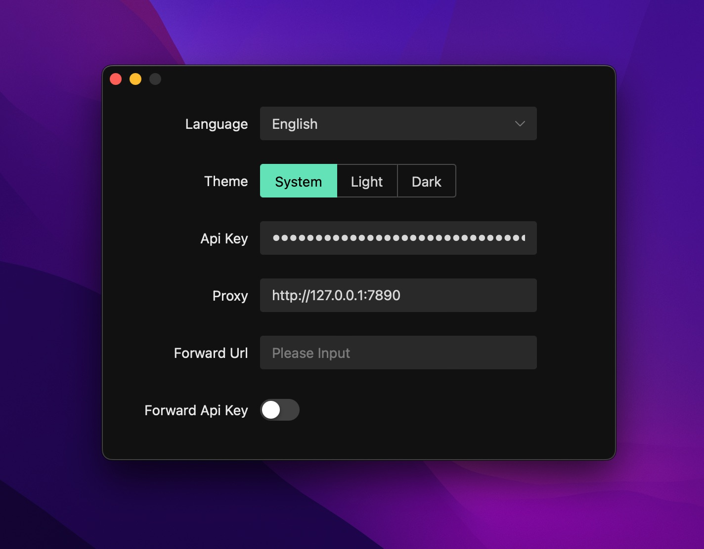

<p align="center">
  
  <h1 align="center">AskAI</h1>
  <p align="center">OpenAI 聊天桌面客户端 (Windows, MacOS, Linux)</p>
</p>

[](./README.md)

[](https://github.com/lisiur/askai/releases)

## 截图









## 特性

- 支持聊天参数配置
- 支持本地提示词
- 支持提示词市场
- 支持多种语言
- 支持代理
- 支持主题
- 支持转发聊天接口

## 安装

下载[最新发行版](https://github.com/lisiur/askai/releases)

## 开发

- 生成图标

    ```bash
    cd gui && cargo tauri icon icons/app-icon.png
    ```
- 启动开发
    ```bash
    pnpm install && cd gui/web && pnpm install
    pnpm dev
    ```

## 常见问题

-  MacOS 可能会遇到这个问题: `"askai.app" 已损坏，无法打开。 您应该将它移到废纸篓。`

    打开终端输入：

    ```shell
    xattr -cr /Applications/askai.app
    ```

