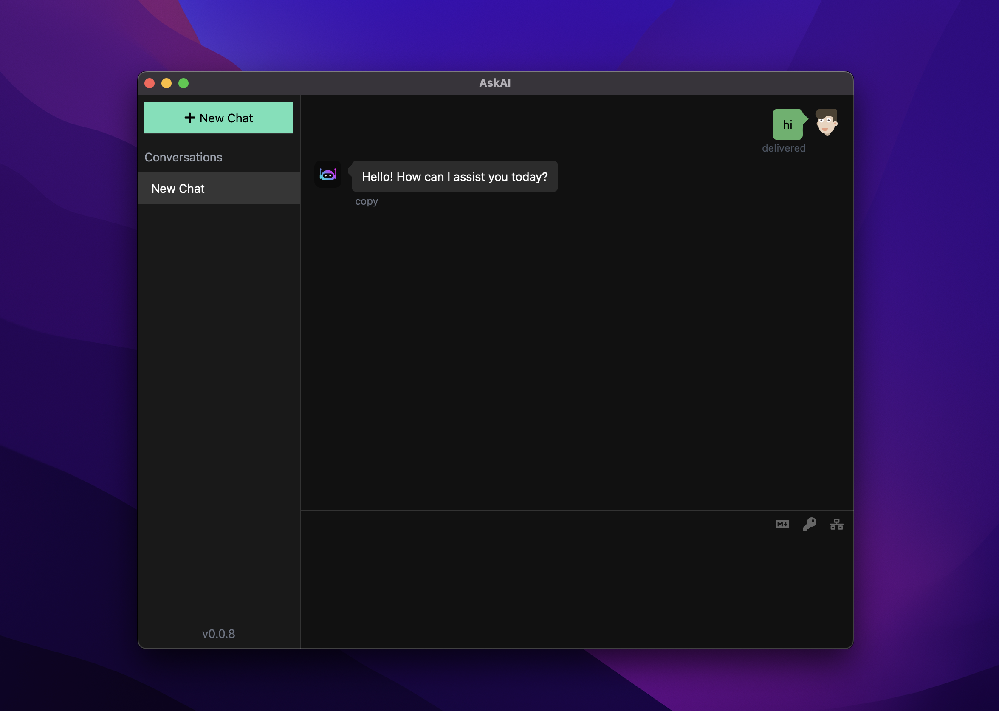
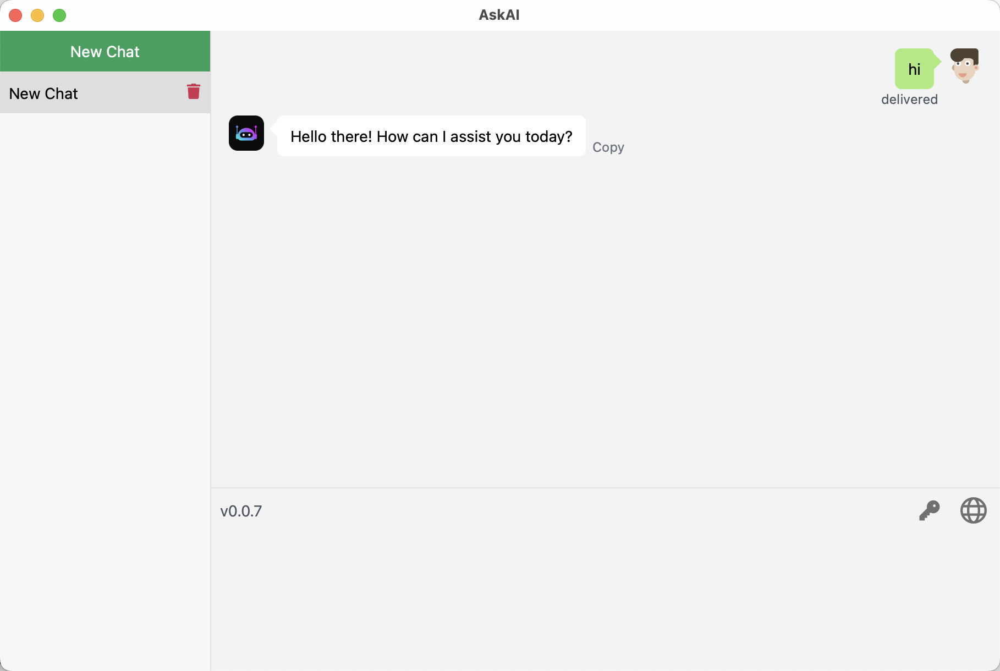
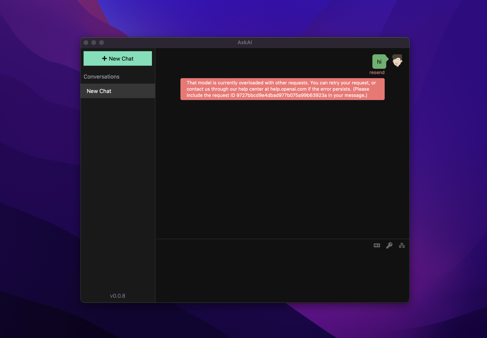

# AskAI

AskAI is an OpenAI chat client desktop app (Windows, MacOS, Linux)

## Screenshots





## Installation

Download [latest release](https://github.com/lisiur/askai/releases)

## Q&A
1.  MacOS users may encounter this problem: `"askai.app" is damaged and can't be opened. You should move it to the Trash.`

    ```shell
    xattr -cr /Applications/askai.app
    ```