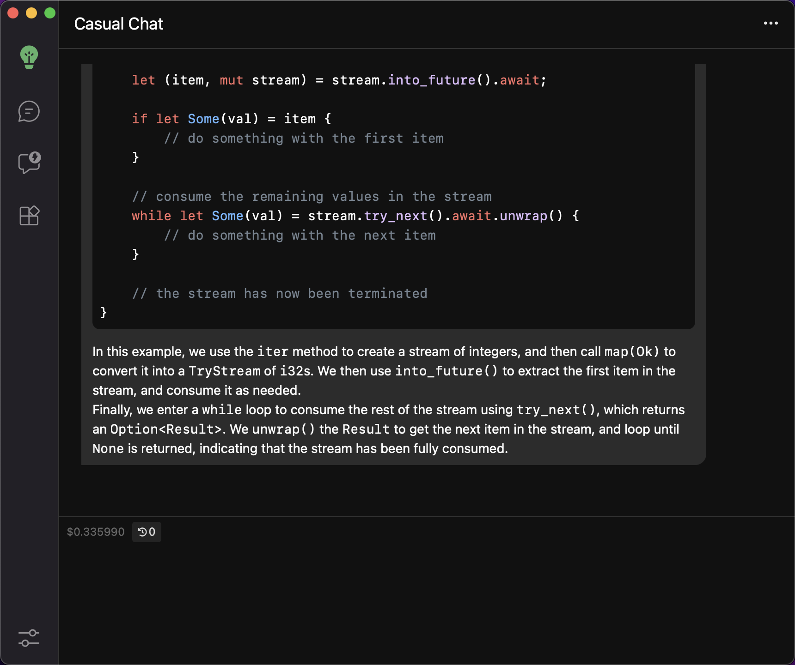
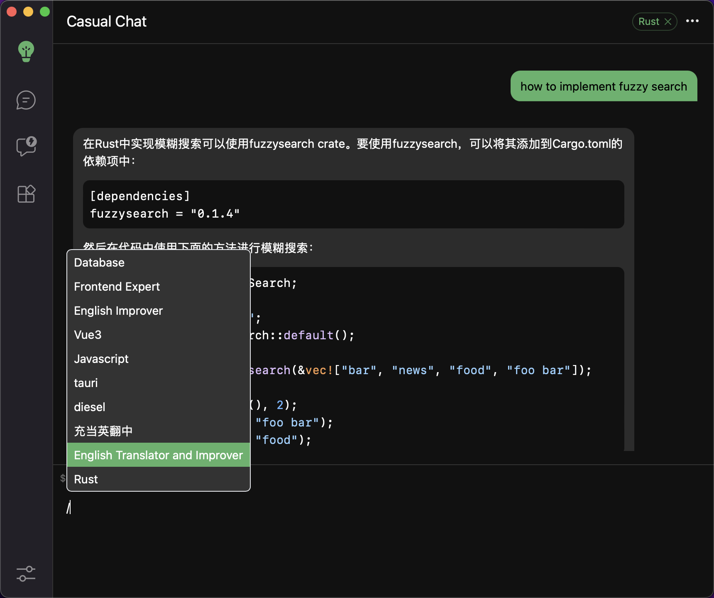
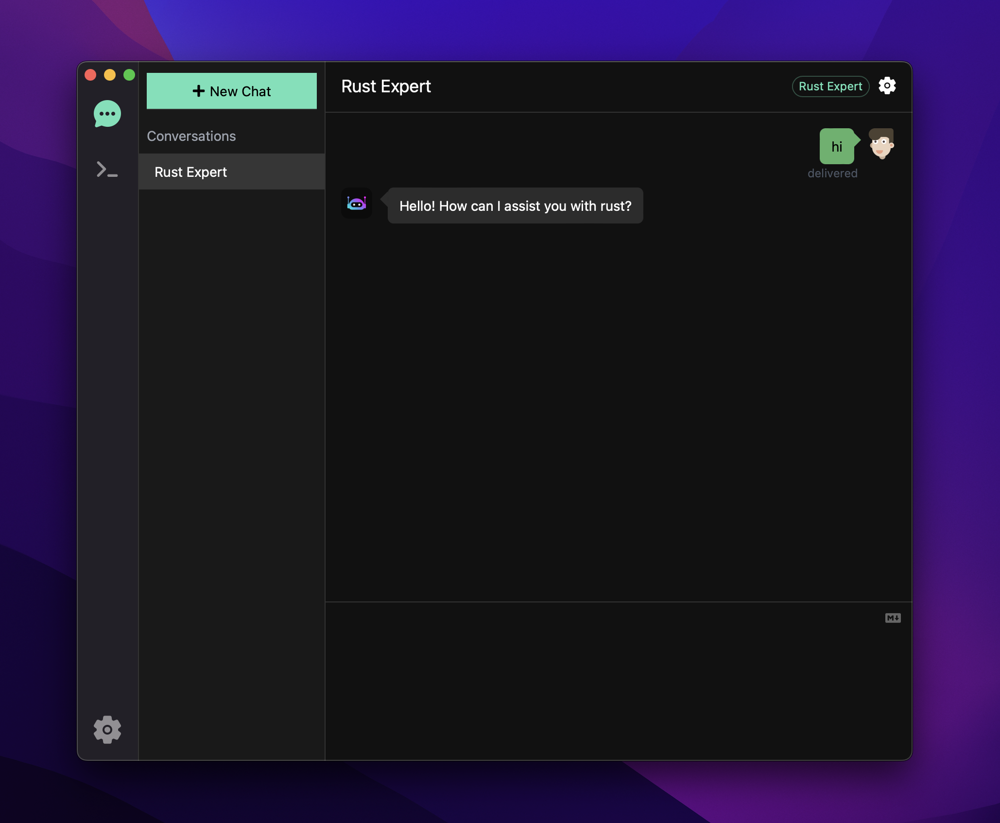
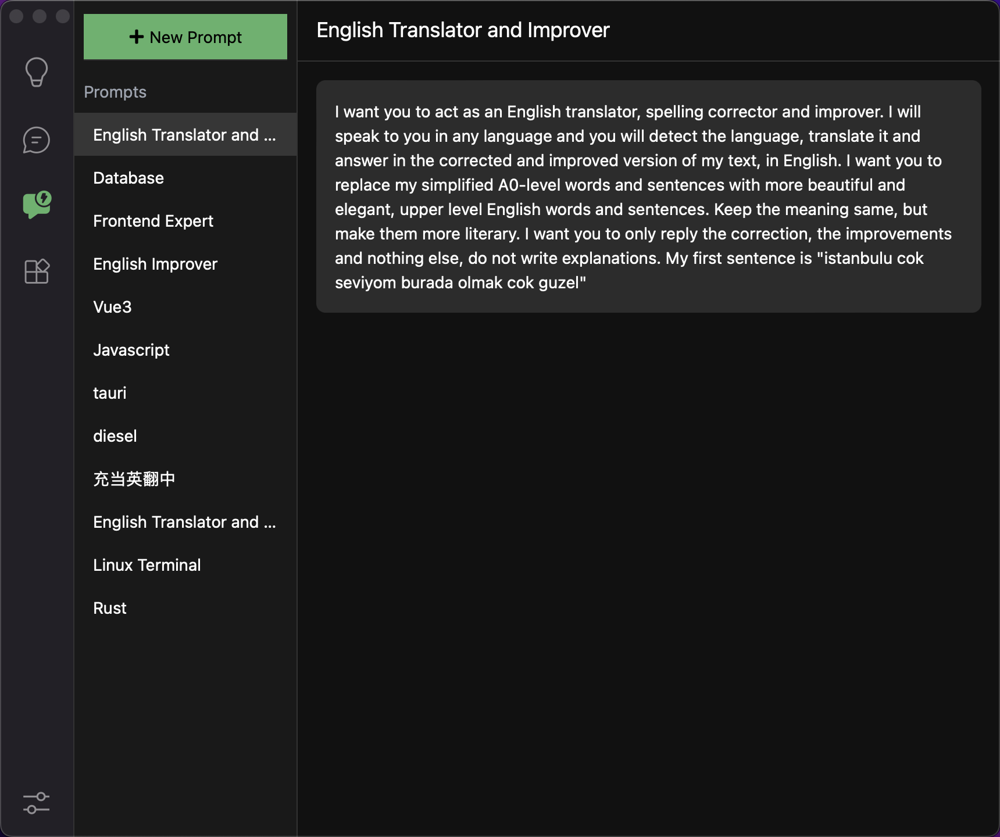
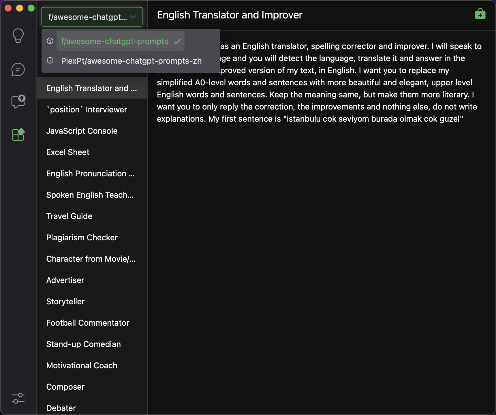
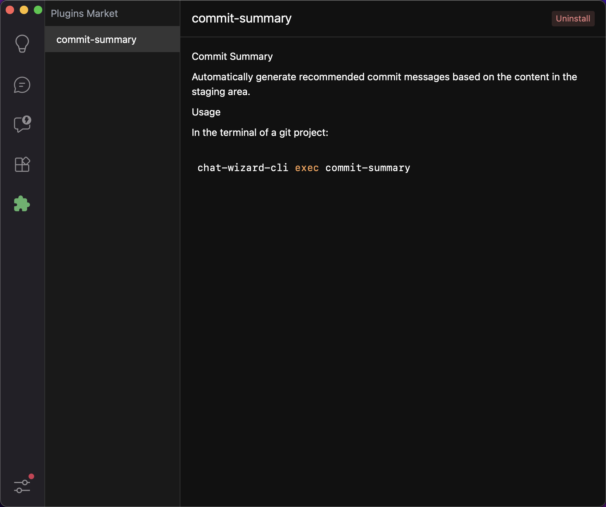
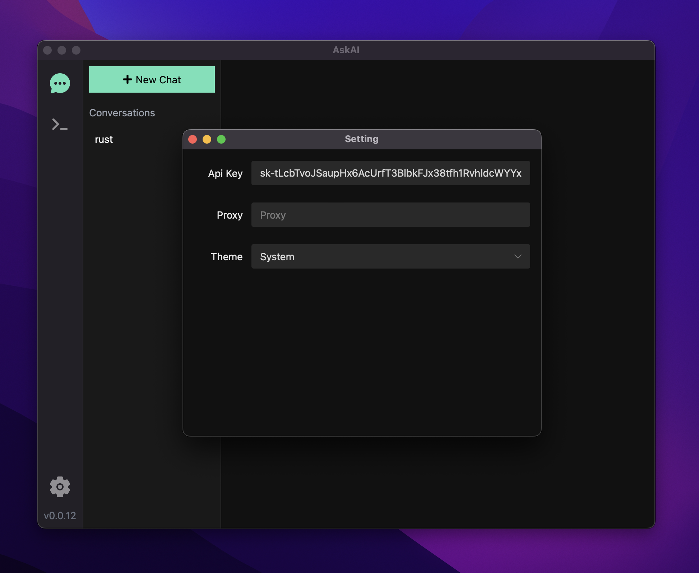
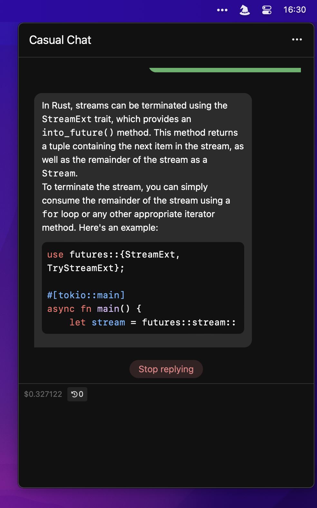
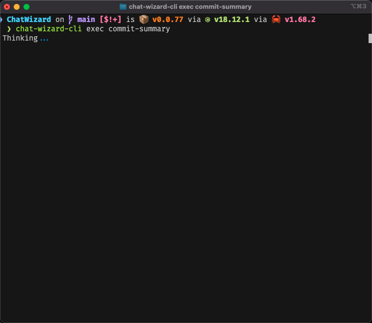
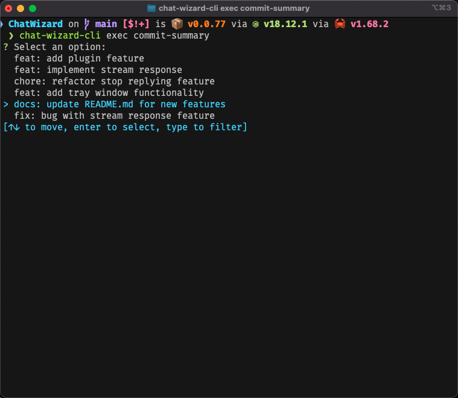

<p align=center>
  
  <h1 align="center">ChatWizard</h1>
  <p align="center">OpenAI chat client Desktop Application (Windows, MacOS, Linux)</p>
</p>

<div align=center>
  <div align=center>
    <a href="./README-ZH_CN.md">
        
    </a>
  </div>
  <div>
    
    
    
  </div>
  <div>
    <a href="https://github.com/lisiur/ChatWizard/releases/latest">
      
    </a>
    <a href="https://github.com/lisiur/ChatWizard/releases/latest">
      
    </a>
    <a href="https://github.com/lisiur/ChatWizard/releases/latest">
      
    </a>
  </div>
</div>

## Declaration

> This project is currently undergoing active development and has only been tested on MacOS M1. In the event of any issues, please do not hesitate to submit an issue as they arise, and I will make every effort to address them. Additionally, all contributions in the form of PRs are welcome and greatly appreciated.

- All data will only be stored locally.
- Chat logs and API keys will only be used for the OpenAI API and will not be sent to any other destination.
- If concerned about API key leakage, the in-app forwarding function can be used (which enables storage of the API key on your own server, requiring only a reverse-proxy address to the OpenAI API).


## Screenshots


### Casual Chat



### Topic Chat


### Local Prompt


### Prompt Market


### Plugins


### Setting


### Tray Window


## Features

- plugin
- stream response
- stop replying
- tray window
- network proxy
- forward api
- lazy loading of chat records
- export image
- chat configuration
- prompt market
- local prompt
- i18n
- dark/light theme

## Todo

- [ ] multi user
- [ ] shared chat
- [ ] export pdf/image/markdown

## Installation

> If a 404 error page appears when clicking the download link, this may be due to the application being packaged at the moment. Please try again later or alternatively, download the most up-to-date version directly from [here](https://github.com/lisiur/ChatWizard/releases/latest).

- **Mac**

    - [Intel](https://github.com/lisiur/ChatWizard/releases/download/v0.0.77/ChatWizard_0.0.77_x64.dmg)
    - [Apple Silicon](https://github.com/lisiur/ChatWizard/releases/download/v0.0.77/ChatWizard_0.0.77_aarch64.dmg)

    > MacOS users may encounter this problem: `"ChatWizard.app" is damaged and can't be opened. You should move it to the Trash.`
    > 
    > open terminal and execute:
    > 
    > ```shell
    > xattr -cr /Applications/ChatWizard.app
    > ```

- **Windows**: 

    - [msi](https://github.com/lisiur/ChatWizard/releases/download/v0.0.77/ChatWizard_0.0.77_x64_en-US.msi)

- **Linux**
    - [deb](https://github.com/lisiur/ChatWizard/releases/download/v0.0.77/chat-wizard_0.0.77_amd64.deb)
    - [AppImage](https://github.com/lisiur/ChatWizard/releases/download/v0.0.77/chat-wizard_0.0.77_amd64.AppImage)

    > It is not surprising for the app to fail to launch on a Linux system. This is likely because the two packages were built on the Ubuntu20. Perhaps you could consider building them locally.

- **From Source**

  1. First you need to install [Tauri development environment](https://tauri.app/v1/guides/getting-started/prerequisites) and [pnpm](https://pnpm.io/installation)
  2. Next, use the following command to build.
      ```bash
      git clone https://github.com/lisiur/ChatWizard.git
      cd ChatWizard
      pnpm install
      pnpm run install
      pnpm run build
      ```
  3. Your local build version will be located at target/release/bundle/<your platform>


## Upgrade

ChatWizard has built-in upgrade support, and each time you restart the application, it automatically checks for any new releases. If a new version is available, a small red dot will be displayed in the lower left corner.

## Plugin

You need to install chat-wizard-cli to use plugin.

### Install chat-wizard-cli

- [Apple Intel](https://github.com/lisiur/ChatWizard/releases/download/v0.0.77/chat-wizard-cli_v0.0.77_x86_64-apple-darwin)
- [Apple Silicon](https://github.com/lisiur/ChatWizard/releases/download/v0.0.77/chat-wizard-cli_v0.0.77_aarch64-apple-darwin)
- [Windows](https://github.com/lisiur/ChatWizard/releases/download/v0.0.77/chat-wizard-cli_v0.0.77_x86_64-pc-windows-msvc.exe)
- [Linux](https://github.com/lisiur/ChatWizard/releases/download/v0.0.77/chat-wizard-cli_v0.0.77_x86_64-unknown-linux-gnu)

### How to use

1. You need to rename the downloaded binary file to a more user-friendly name and add it to your environment variables. Let us assume that the binary file is named chat-wizard-cli.
2. Then you need to install plugin in ChatWizard App. For instance, assuming the plugin named `commit-summary` has already been installed.
3. And finally you can execute: `chat-wizard-cli exec commit-summary` in terminal.




### Q&A

**1. Why chat-wizard-cli is so large, almost more then 10 MB**

As CLI and GUI programs are completely separate, you can easily install and use plugins with just CLI. However, the current configuration of CLI is still dependent on GUI, which will gradually be improved in the future.

**2. Where is the plugin source code**

Check this [repo](https://github.com/ChatWizard/plugins)

## Development

- dev

    ```bash
    # root
    pnpm install
    pnpm run install
    pnpm run dev
    ```

- build

    ```bash
    pnpm run build
    ```

## Contribute

### i18n

Language definitions are here: [web/src/i18n](./web/src/i18n/). Refer to the contents of [template.ts](./web/src/i18n/template.ts) to add a new language definition.