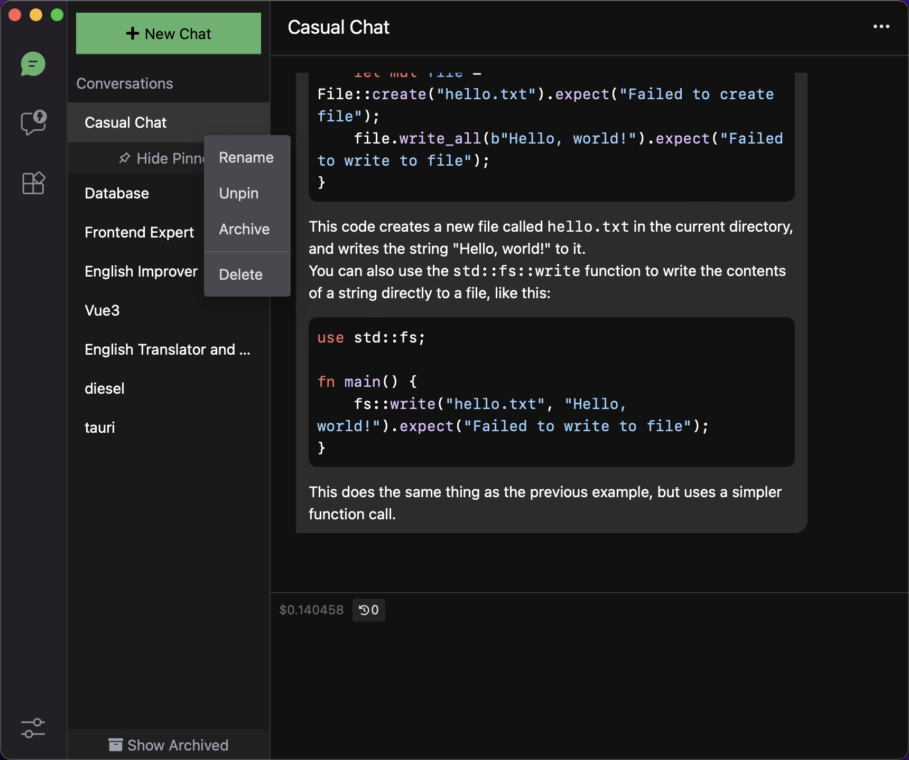
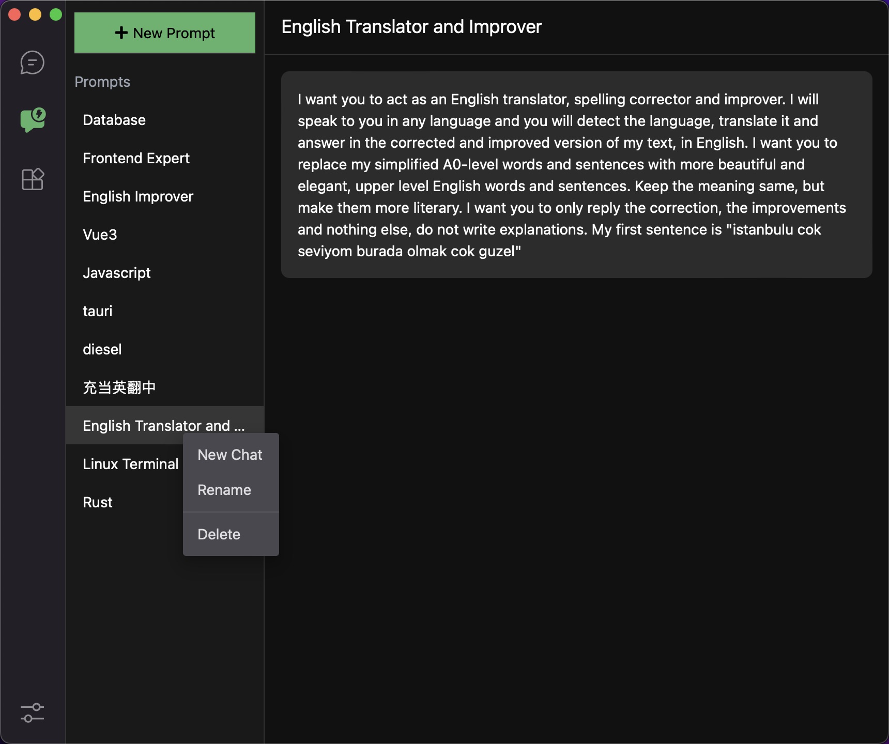
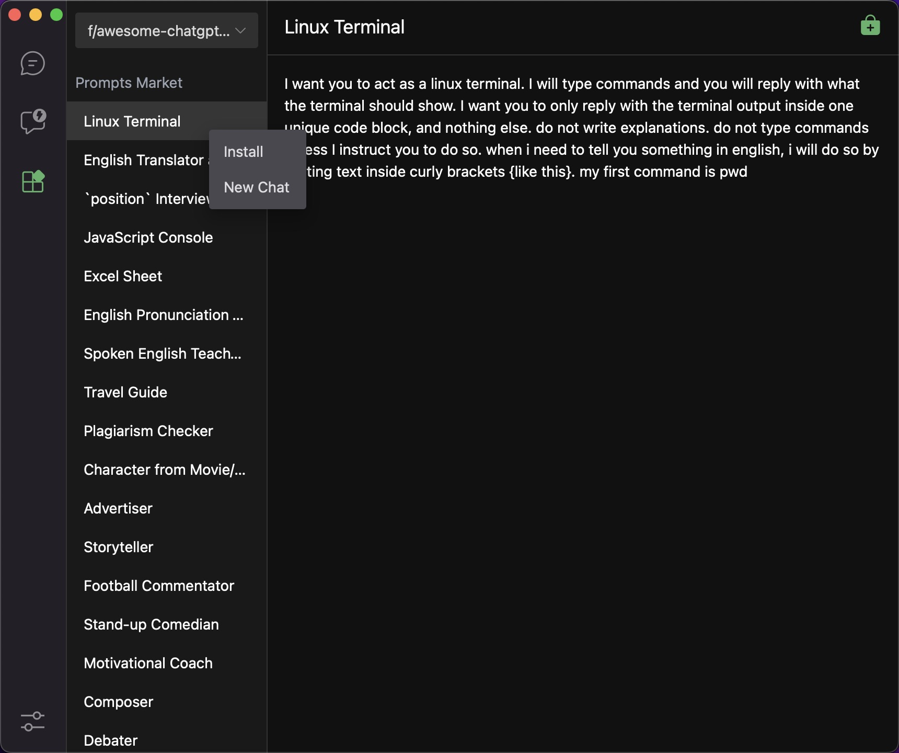
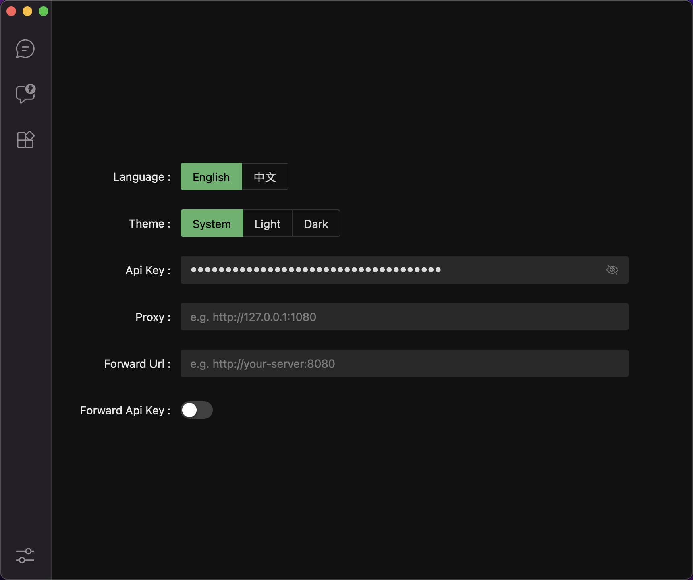
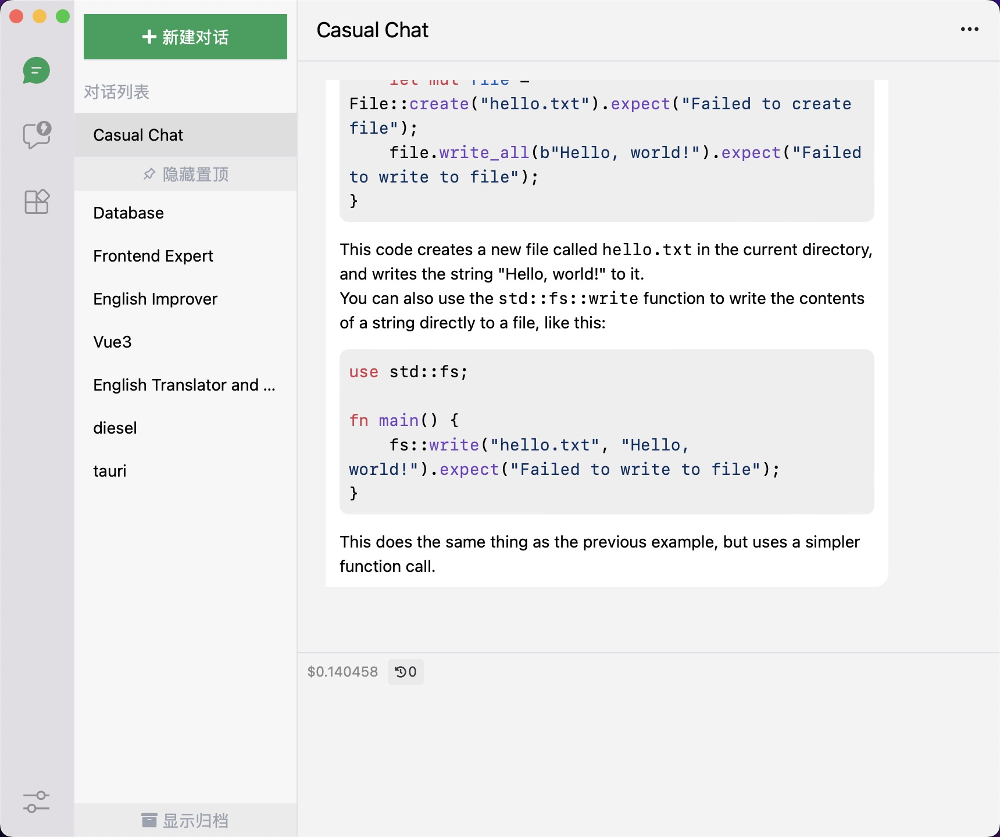

<p align=center>
  
  <h1 align="center">ChatWizard</h1>
  <p align="center">OpenAI chat client Desktop Application (Windows, MacOS, Linux)</p>
</p>

<div align=center>
  <div align=center>
    <a href="./README-ZH_CN.md">
        
    </a>
  </div>
  <div>
    
    
    
  </div>
  <div>
    <a href="https://github.com/Synaptrix/ChatGPT-Desktop/releases/latest">
      
    </a>
    <a href="https://github.com/Synaptrix/ChatGPT-Desktop/releases/latest">
      
    </a>
    <a href="https://github.com/Synaptrix/ChatGPT-Desktop/releases/latest">
      
    </a>
  </div>
</div>

## Declaration

This project is currently undergoing active development and has only been tested on MacOS M1. In the event of any issues, please do not hesitate to submit an issue as they arise, and I will make every effort to address them. Additionally, all contributions in the form of PRs are welcome and greatly appreciated.

## Screenshots

<details>
<summary>View</summary>









</details>

## Features

- support stream reply
- support chat configuration
- support lazy loading of chat records
- support local prompt
- support prompt market
- support multiple language
- support proxy
- support theme
- support forward openai api

## Installation

- **Mac**

    - [Intel](https://github.com/lisiur/ChatWizard/releases/download/v0.0.42/ChatWizard_0.0.42_x64.dmg)
    - [Apple Silicon](https://github.com/lisiur/ChatWizard/releases/download/v0.0.42/ChatWizard_0.0.42_aarch64.dmg)

    > MacOS users may encounter this problem: `"ChatWizard.app" is damaged and can't be opened. You should move it to the Trash.`
    > 
    > open terminal and execute:
    > 
    > ```shell
    > xattr -cr /Applications/ChatWizard.app
    > ```

- **Windows**: 

    - [msi](https://github.com/lisiur/ChatWizard/releases/download/v0.0.42/ChatWizard_0.0.42_x64_en-US.msi)

- **Linux**
    - [deb](https://github.com/lisiur/ChatWizard/releases/download/v0.0.42/chat-wizard_0.0.42_amd64.deb)
    - [AppImage](https://github.com/lisiur/ChatWizard/releases/download/v0.0.42/chat-wizard_0.0.42_amd64.AppImage)

## Development

- dev

    ```bash
    # root
    pnpm install
    pnpm run install
    pnpm run dev
    ```

- build

    ```bash
    pnpm run build
    ```

